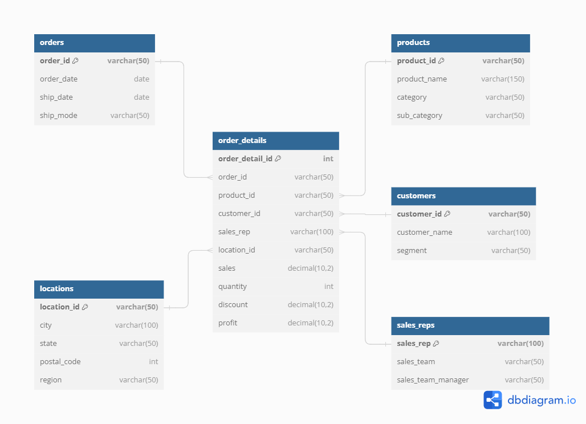

# SuperStore ETL Docker Airflow Project

## Objectif du projet

L'objectif de ce projet est de construire un pipeline ETL (Extraction, Transformation, Chargement) pour traiter les données de vente d'un magasin SuperStore. Ce projet utilise Docker pour orchestrer plusieurs services, dont Airflow pour la gestion du pipeline ETL, MySQL pour le stockage des données, et Jupyter pour l'analyse des données. Les données brutes sont extraites d'un fichier CSV, nettoyées et transformées, puis chargées dans une base de données MySQL pour une analyse ultérieure.

## Structure du projet

La structure du projet est organisée comme suit :

```
superstore-etl-docker-airflow-project/
├── docker-compose.yml
├── .env
├── airflow/
│   ├── dags/
│   │   └── superstore_etl.py
│   ├── logs/
│   ├── plugins/
│   ├── Dockerfile
│   └── requirements.txt
├── data/
│    └── SuperStoreRawData.csv
├── jupyter/
│   ├── Dockerfile
│   └── requirements.txt
├── mysql/
│   ├── init.sql
│   └── my.cnf
└── notebooks/
    └── analysis.ipynb
```

### Détails des dossiers et fichiers

- **docker-compose.yml** : Fichier de configuration Docker Compose qui orchestre tous les services nécessaires (MySQL, Airflow, Jupyter, Adminer).
- **.env** : Fichier de variables d'environnement pour configurer les mots de passe, les noms de base de données, et autres paramètres nécessaires aux services.
- **airflow/** :
  - **dags/** : Contient le script Airflow `superstore_etl.py` qui définit le pipeline ETL.
  - **logs/** : Répertoire pour les logs générés par Airflow.
  - **plugins/** : Répertoire pour ajouter des plugins Airflow personnalisés.
  - **Dockerfile** : Fichier Docker pour créer une image Airflow personnalisée avec les dépendances spécifiées dans `requirements.txt`.
  - **requirements.txt** : Fichier contenant les dépendances Python nécessaires à Airflow, comme `mysql-connector-python`.
- **data/** :
  - **SuperStoreRawData.csv** : Fichier de données brutes à traiter par le pipeline ETL.
- **jupyter/** :
  - **Dockerfile** : Fichier Docker pour créer une image Jupyter personnalisée capable de se connecter à la base de données MySQL.
  - **requirements.txt** : Fichier contenant les packages Python nécessaires à Jupyter, comme `mysql-connector-python`, `SQLAlchemy`, etc.
- **mysql/** :
  - **init.sql** : Script SQL pour initialiser la base de données (non utilisé directement dans le pipeline mais disponible si nécessaire).
  - **my.cnf** : Fichier de configuration MySQL personnalisé.
- **notebooks/** :
  - **analysis.ipynb** : Notebook Jupyter pour l'analyse exploratoire des données chargées dans MySQL.

## Comprendre le fichier `docker-compose.yml`

Le fichier `docker-compose.yml` est le cœur de l'orchestration de vos services Docker dans ce projet. Il permet de configurer, de déployer et de gérer les différents conteneurs nécessaires au pipeline ETL. Voici un aperçu détaillé de chaque service et de leur configuration :

### Services définis

#### 1. **MySQL**
   - **Image** : `mysql:latest`
   - **Nom du conteneur** : `mysql`
   - **Configuration** :
     - Le conteneur utilise la dernière version de MySQL.
     - Les variables d'environnement (`MYSQL_ROOT_PASSWORD`, `MYSQL_DATABASE`) sont chargées depuis le fichier `.env`.
     - **Volumes** :
       - Les données MySQL sont persistées sur un volume Docker (`mysql_data`) pour garantir que les données restent intactes même après le redémarrage du conteneur.
       - Un fichier de configuration MySQL personnalisé (`my.cnf`) est monté dans le conteneur.
     - **Réseau** : Le conteneur est connecté au réseau `airflow_network`.

#### 2. **Adminer**
   - **Image** : `adminer`
   - **Nom du conteneur** : `adminer`
   - **Ports** : Expose l'interface Adminer sur le port `8081`.
   - **Dépendances** : Dépend de MySQL et ne s'exécute que si MySQL est disponible.
   - **Objectif** : Fournir une interface web pour gérer et interagir avec la base de données MySQL.

#### 3. **Jupyter**
   - **Build** : Le conteneur est construit à partir d'un Dockerfile personnalisé dans le répertoire `./jupyter`.
   - **Nom du conteneur** : `jupyter`
   - **Volumes** : Monte les notebooks Jupyter dans le conteneur pour permettre l'accès aux analyses.
   - **Ports** : Expose Jupyter Notebook sur le port `8887`.
   - **Variables d'environnement** : Paramètres MySQL configurés pour permettre la connexion aux bases de données depuis Jupyter.
   - **Commandes** : Démarre Jupyter Notebook avec les options appropriées.
   - **Réseau** : Connecté au réseau `airflow_network`.

#### 4. **Airflow**
   - **Build** : Le conteneur est construit à partir d'un Dockerfile personnalisé dans le répertoire `./airflow`.
   - **Nom du conteneur** : `airflow`
   - **Configuration** :
     - Utilise un exécuteur local et se connecte à MySQL pour gérer la base de données Airflow.
     - Monte les répertoires pour les DAGs, logs, plugins, et les fichiers de données.
   - **Ports** : Expose l'interface Airflow Web sur le port `8080`.
   - **Commandes** : Démarre le `scheduler` et le `webserver` d'Airflow.
   - **Dépendances** :
     - Dépend du service `mysql` pour s'assurer que MySQL est prêt et que la base de données Airflow est correctement initialisée avant de démarrer.
   - **Réseau** : Connecté au réseau `airflow_network`.

### Volumes

- **mysql_data** : Volume pour le stockage persistant des données MySQL. Cela garantit que les données de votre base de données sont conservées même si le conteneur MySQL est recréé.

### Réseau

- **airflow_network** : Un réseau Docker dédié qui relie tous les services du projet, leur permettant de communiquer entre eux de manière isolée et sécurisée.

## Fichier `.env`

Créez un fichier `.env` à la racine du projet avec le contenu suivant comme exemple :

```env
MYSQL_ROOT=root
MYSQL_ROOT_PASSWORD=root
MYSQL_HOST=mysql
MYSQL_DATABASE=airflow_db
MYSQL_USER=airflow
MYSQL_PASSWORD=123
SUPERSTORE_MYSQL_DATABASE=superstore
DATA_FILE_PATH=/data/SuperStoreRawData.csv
```

Le fichier `.env` contient des variables d'environnement qui sont utilisées pour configurer les services MySQL et les chemins de fichiers dans votre projet. Voici les variables définies :

- **MYSQL_ROOT** : L'utilisateur root de MySQL.
- **MYSQL_ROOT_PASSWORD** : Mot de passe pour l'utilisateur root de MySQL.
- **MYSQL_HOST** : Hôte de la base de données MySQL (nom du service dans Docker Compose).
- **MYSQL_DATABASE** : Nom de la base de données utilisée par Airflow.
- **MYSQL_USER** : Nom d'utilisateur pour MySQL (utilisé par Airflow et pour l'ETL).
- **MYSQL_PASSWORD** : Mot de passe pour l'utilisateur MySQL.
- **SUPERSTORE_MYSQL_DATABASE** : Nom de la base de données spécifique pour les données SuperStore.
- **DATA_FILE_PATH** : Chemin du fichier CSV contenant les données SuperStore, monté dans le conteneur Docker.

## Modélisation ERD

La base de données MySQL pour ce projet est structurée selon un schéma relationnel classique, où les données sont organisées en plusieurs tables interconnectées. Chaque table représente une entité clé du modèle de données SuperStore, avec des relations bien définies entre elles via des clés primaires et étrangères. Le diagramme ERD ci-dessous illustre la structure et les relations entre ces tables :



### Détails des tables

#### 1. **customers** (Clients)
- **Description** : Cette table stocke les informations sur les clients.
- **Colonnes** :
  - `customer_id` (PRIMARY KEY) : Identifiant unique pour chaque client.
  - `customer_name` : Nom du client.
  - `segment` : Segment de marché auquel appartient le client (par exemple, "Consommateur", "Entreprise").
  
#### 2. **products** (Produits)
- **Description** : Cette table contient des informations sur les produits vendus par le SuperStore.
- **Colonnes** :
  - `product_id` (PRIMARY KEY) : Identifiant unique pour chaque produit.
  - `product_name` : Nom du produit.
  - `category` : Catégorie du produit (par exemple, "Mobilier", "Fournitures de bureau").
  - `sub

_category` : Sous-catégorie du produit (par exemple, "Chaises", "Accessoires de bureau").
  
#### 3. **sales_reps** (Représentants des ventes)
- **Description** : Cette table garde une trace des représentants des ventes et de leurs équipes.
- **Colonnes** :
  - `sales_rep` (PRIMARY KEY) : Identifiant unique ou nom du représentant commercial.
  - `sales_team` : Nom de l'équipe de vente à laquelle appartient le représentant.
  - `sales_team_manager` : Nom du manager de l'équipe de vente.
  
#### 4. **locations** (Emplacements)
- **Description** : Cette table stocke les informations relatives aux emplacements (villes, états) où les ventes ont lieu.
- **Colonnes** :
  - `location_id` (PRIMARY KEY) : Identifiant unique pour chaque emplacement (peut être une combinaison du code postal et de la ville).
  - `city` : Nom de la ville.
  - `state` : État ou région.
  - `postal_code` : Code postal.
  - `region` : Région géographique (par exemple, "Nord", "Sud").

#### 5. **orders** (Commandes)
- **Description** : Cette table contient des informations de haut niveau sur les commandes passées par les clients.
- **Colonnes** :
  - `order_id` (PRIMARY KEY) : Identifiant unique pour chaque commande.
  - `order_date` : Date à laquelle la commande a été passée.
  - `ship_date` : Date d'expédition de la commande.
  - `ship_mode` : Mode d'expédition utilisé (par exemple, "Classe standard", "Seconde classe").

#### 6. **order_details** (Détails des commandes)
- **Description** : Cette table enregistre les détails spécifiques pour chaque commande, y compris les produits commandés, les quantités, et les ventes.
- **Colonnes** :
  - `order_detail_id` (PRIMARY KEY, AUTO_INCREMENT) : Identifiant unique pour chaque enregistrement de détail de commande.
  - `order_id` (FOREIGN KEY) : Fait référence à `order_id` dans la table `orders`.
  - `product_id` (FOREIGN KEY) : Fait référence à `product_id` dans la table `products`.
  - `customer_id` (FOREIGN KEY) : Fait référence à `customer_id` dans la table `customers`.
  - `sales_rep` (FOREIGN KEY) : Fait référence à `sales_rep` dans la table `sales_reps`.
  - `location_id` (FOREIGN KEY) : Fait référence à `location_id` dans la table `locations`.
  - `sales` : Montant des ventes pour cet enregistrement.
  - `quantity` : Quantité de produit commandée.
  - `discount` : Remise appliquée à cet enregistrement.
  - `profit` : Bénéfice réalisé sur cet enregistrement.

### Relations entre les tables

Les relations entre les tables sont établies via des clés étrangères (`FOREIGN KEY`), assurant l'intégrité des données à travers la base de données :

- **orders** ↔ **order_details** : La table `orders` est liée à `order_details` via la clé primaire `order_id`, permettant de regrouper tous les détails associés à une commande spécifique.
- **products** ↔ **order_details** : La table `products` est liée à `order_details` via la clé primaire `product_id`, associant chaque produit à ses détails de commande respectifs.
- **customers** ↔ **order_details** : La table `customers` est liée à `order_details` via la clé primaire `customer_id`, permettant de relier chaque détail de commande à un client spécifique.
- **sales_reps** ↔ **order_details** : La table `sales_reps` est liée à `order_details` via la clé primaire `sales_rep`, associant chaque vente à un représentant commercial.
- **locations** ↔ **order_details** : La table `locations` est liée à `order_details` via la clé primaire `location_id`, liant chaque commande à un emplacement spécifique.

Ces relations permettent de structurer les données de manière à garantir leur cohérence et à faciliter les requêtes complexes pour des analyses approfondies.

## Pipeline ETL

Le pipeline ETL est géré par Apache Airflow et est défini dans le fichier `superstore_etl.py`. Le processus complet est organisé en quatre tâches principales :

1. **create_tables** : Cette tâche crée les tables nécessaires dans la base de données MySQL conformément à la modélisation ERD (Entity-Relationship Diagram) définie pour le projet. Chaque table est créée avec des colonnes spécifiques, des clés primaires et des clés étrangères pour garantir l'intégrité et la structure des données. La création des tables suit strictement le schéma relationnel, en veillant à établir les relations entre les entités telles que `customers`, `products`, `orders`, `order_details`, etc.

2. **extract** : Cette tâche extrait les données brutes du fichier CSV `SuperStoreRawData.csv` et les enregistre dans un fichier temporaire sur le système de fichiers local. Ces données brutes constituent la matière première pour les étapes de transformation suivantes.

3. **transform** : Cette tâche nettoie et transforme les données extraites pour qu'elles soient prêtes à être chargées dans la base de données MySQL. Les étapes de transformation incluent :
   - **Gestion des valeurs manquantes** : Les lignes contenant des valeurs nulles ou manquantes sont supprimées pour garantir la qualité des données.
   - **Suppression des duplicatas** : Les doublons sont supprimés afin d'éviter toute redondance dans la base de données.
   - **Traitement des valeurs aberrantes** : Les valeurs de la colonne `sales` qui sont considérées comme aberrantes (trop faibles ou trop élevées) par rapport à l'écart interquartile (IQR) sont filtrées.
   - **Uniformisation des formats de données** : Les dates sont normalisées au format `YYYY-MM-DD` pour assurer la cohérence dans la base de données.
   - **Correction des valeurs incorrectes** : Les valeurs négatives dans la colonne `quantity` sont corrigées en utilisant la valeur absolue.
   - Les données transformées sont ensuite enregistrées dans un fichier temporaire pour être prêtes à être chargées.

4. **load** : Cette tâche charge les données transformées dans les tables MySQL. Pour chaque ligne du fichier de données transformées :
   - Les données sont insérées dans les tables correspondantes (`customers`, `products`, `sales_reps`, `locations`, `orders`, `order_details`).
   - Les opérations `INSERT` utilisent la clause `ON DUPLICATE KEY UPDATE` pour s'assurer que les enregistrements existants sont mis à jour sans créer de doublons. Cela garantit que les dernières informations sont correctement enregistrées dans la base de données.
   - Les relations définies par les clés étrangères sont respectées lors de l'insertion des données, assurant ainsi l'intégrité référentielle entre les tables.

### Utilisation du pipeline ETL

Pour utiliser le pipeline ETL, suivez ces étapes détaillées :

#### 1. **Cloner le projet**
  - Commencez par cloner le dépôt du projet sur votre machine locale en utilisant Git :
    ```bash
    git clone https://github.com/mnassrib/superstore-etl-docker-airflow-project.git       
    cd superstore-etl-docker-airflow-project
    ```

#### 2. **Configurer les variables d'environnement**
  - Assurez-vous que le fichier `.env` est correctement configuré avec vos paramètres de base de données et autres variables d'environnement. Ce fichier définit les mots de passe MySQL, les noms de bases de données, et les chemins des fichiers nécessaires au bon fonctionnement des services.

#### 3. **Démarrer les services avec Docker Compose**
  - Ouvrez un terminal dans le répertoire du projet cloné.
  - Pour démarrer tous les services (MySQL, Airflow, Jupyter, Adminer), exécutez la commande suivante :
    ```bash
    docker-compose up -d
    ```
  - L'option `-d` lance les conteneurs en arrière-plan. Si vous souhaitez voir les logs en temps réel, vous pouvez omettre `-d`.

  - **Vérifier les services** :
    - Vous pouvez vérifier si les services fonctionnent correctement en utilisant :
      ```bash
      docker-compose ps
      ```
    - Cette commande vous montrera l'état de chaque conteneur.

  - **Voir les logs** :
    - Pour afficher les logs d'un service particulier (par exemple, Airflow) :
      ```bash
      docker-compose logs airflow
      ```
    - Pour suivre les logs en temps réel :
      ```bash
      docker-compose logs -f airflow
      ```

  - **Arrêter les services** :
    - Pour arrêter tous les services, utilisez :
       ```bash
       docker-compose down
       ```
  - **Relancer un service individuellement** :
    - Si vous souhaitez relancer un seul service (par exemple, Jupyter) sans toucher aux autres :
    ```bash
    docker-compose up -d jupyter
    ``` 

#### 4. **Accéder à l'interface web d'Airflow**
   - Airflow est l'outil principal pour gérer et visualiser le pipeline ETL. Pour y accéder, ouvrez votre navigateur et allez à l'adresse suivante :
     ```
     http://localhost:8080
     ```
   - **Connexion** :
     - Utilisez les identifiants par défaut : nom d'utilisateur `admin` et mot de passe `admin`.
     - Vous pouvez personnaliser ces informations dans le fichier `docker-compose.yml` ou dans l'interface web.

   - **Explorer l'interface** :
     - **Vue des DAGs** : Vous verrez une liste des DAGs (Graphes Acycliques Dirigés), y compris celui nommé `superstore_etl`. Cette interface vous permet de visualiser les DAGs disponibles et leur état actuel.
     - **Activer le DAG** : Pour exécuter le pipeline ETL, activez le DAG `superstore_etl` en basculant l'interrupteur à côté de son nom.
     - **Exécuter manuellement** : Vous pouvez déclencher une exécution manuelle du DAG en cliquant sur le bouton `Trigger DAG`.
     - **Historique et logs** : Airflow permet de visualiser l'historique des exécutions des tâches, ainsi que les logs détaillés pour diagnostiquer les erreurs ou suivre le déroulement des opérations.

#### 5. **Accéder à Adminer pour gérer la base de données**
   - Adminer est un outil web qui vous permet de gérer la base de données MySQL. Il est particulièrement utile pour inspecter les tables, exécuter des requêtes SQL manuelles, et visualiser les données chargées.
   - Pour accéder à Adminer, allez à l'adresse suivante dans votre navigateur :
     ```
     http://localhost:8081
     ```

  - **Connexion à la base de données** :

      Vous pouvez vous connecter à la base de données MySQL de deux manières différentes : en utilisant l'utilisateur `root` (avec `MYSQL_ROOT_PASSWORD`) ou en utilisant un utilisateur standard (avec `MYSQL_USER` et `MYSQL_PASSWORD`).

    - **Option 1 : Connexion avec l'utilisateur root (`MYSQL_ROOT`)**

    Cette méthode utilise l'utilisateur `root` de MySQL, qui a tous les privilèges sur toutes les bases de données.

      - **Serveur** : `mysql`
      - **Nom d'utilisateur** : `MYSQL_ROOT` (par défaut `root`)
      - **Mot de passe** : `MYSQL_ROOT_PASSWORD` (par défaut `root`)
      - **Base de données** : Vous pouvez choisir de ne pas spécifier une base de données particulière pour avoir accès à toutes les bases de données disponibles.

      **Utilisation typique :**

      - Accédez à la base de données en tant que superutilisateur pour gérer toutes les bases de données ou effectuer des tâches administratives avancées.

    - **Option 2 : Connexion avec un utilisateur standard (`MYSQL_USER`)**

    Cette méthode utilise un utilisateur standard avec des privilèges spécifiques à une ou plusieurs bases de données.

      - **Serveur** : `mysql`
      - **Nom d'utilisateur** : `MYSQL_USER` (par défaut `airflow`)
      - **Mot de passe** : `MYSQL_PASSWORD` (par défaut `123`)
      - **Base de données** : Spécifiez la base de données sur laquelle vous souhaitez travailler, par exemple `SUPERSTORE_MYSQL_DATABASE` (par défaut `superstore`).

      **Utilisation typique :**

      - Accédez à une base de données spécifique pour interagir avec les données, exécuter des requêtes, ou effectuer des analyses sans avoir les privilèges superutilisateur complets.

    - **Actions disponibles** :
      - **Visualiser les tables** : Vous pouvez voir les tables créées (`customers`, `products`, `orders`, etc.) et explorer leurs contenus.
      - **Exécuter des requêtes SQL** : Exécutez des requêtes personnalisées pour extraire des données spécifiques ou pour manipuler la base de données directement.

## Analyse des données avec Jupyter

Une fois les données chargées dans MySQL, vous pouvez les analyser en utilisant le notebook Jupyter fourni (`analysis.ipynb`).

### Utilisation de Jupyter

1. **Accéder à Jupyter** :
    - Jupyter Notebook est disponible pour effectuer des analyses exploratoires sur les données une fois qu'elles sont chargées dans MySQL.
    - Pour accéder à Jupyter, allez à l'adresse suivante :
    ```
    http://localhost:8887
    ```

    - Aucune authentification n'est nécessaire.

2. **Exécuter le notebook** :
    - Ouvrez le fichier `analysis.ipynb` dans Jupyter.
    - Ce notebook se connecte à la base de données MySQL, récupère les données de la table `order_details`, et les affiche sous forme de DataFrame pandas.
    - Vous pouvez étendre ce notebook pour effectuer des analyses plus poussées, visualiser les données ou même construire des modèles prédictifs.

## Conclusion

Ce projet met en place un pipeline ETL complet en utilisant Airflow, MySQL et Jupyter, et démontre comment orchestrer ces outils efficacement dans un environnement Docker. Vous pouvez étendre ce projet pour inclure des analyses plus approfondies, des visualisations de données ou même des modèles prédictifs basés sur les données SuperStore.

> Si vous avez des questions ou des suggestions, n'hésitez pas à contribuer au projet ou à ouvrir une issue.
